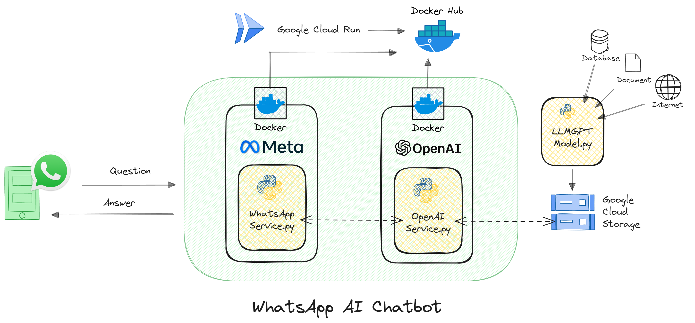

# Chatbot de WhatsApp con IA

Este proyecto implementa un chatbot para WhatsApp utilizando la API de WhatsApp Business, Flask para el backend, y la IA de OpenAI para el procesamiento de lenguaje natural.

## Arquitectura del Proyecto

El sistema se compone de varios componentes clave que trabajan en conjunto para proporcionar una experiencia interactiva a través de WhatsApp:

- Flask Server: Maneja las peticiones HTTP y sirve como el punto de conexión entre WhatsApp y el motor de IA.
- API de WhatsApp Business: Permite recibir y enviar mensajes a través de WhatsApp.
- OpenAI API: Se utiliza para generar respuestas inteligentes a partir de las preguntas recibidas.
- Google Cloud Storage: Almacena y gestiona los vectores de palabras para la IA.

Cuando un mensaje llega a través de WhatsApp, Flask procesa la solicitud, la pasa a la API de OpenAI para generar una respuesta y luego utiliza la API de WhatsApp Business para enviar esta respuesta al usuario.

### Requisitos Previos

Para ejecutar este proyecto necesitas:

- Una cuenta de Google Cloud para el almacenamiento de vectores.
- Una cuenta de desarrollador de Facebook con acceso a la API de WhatsApp Business.
- Acceso a la API de OpenAI.

### Configuración del Proyecto

Variables de Entorno: Configura las siguientes variables de entorno en tu sistema o en un archivo .env:

- WHATSAPP_ACCESS_TOKEN: Tu token de acceso para la API de WhatsApp Business.
- WHATSAPP_VERIFY_TOKEN: Tu token de verificación para la API de WhatsApp Business.
- WHATSAPP_API_URL: La URL de la API de WhatsApp Business.
- OPENAI_SERVICE_URL: La URL de tu servicio que interactúa con la API de OpenAI.
- GOOGLE_APPLICATION_CREDENTIALS: La ruta al archivo de credenciales de tu cuenta de Google Cloud.

**Instalación de Dependencias: Ejecuta pip install -r requirements.txt para instalar las dependencias necesarias.**

#### Ejecución Local:

- Inicia el servidor Flask con python app.py.
- Asegúrate de que los puertos y las URLs de callback estén configurados correctamente en tus servicios de WhatsApp y OpenAI.

#### Despliegue

- Para desplegar este bot, puedes utilizar servicios como Heroku, AWS, o Google Cloud. Asegúrate de configurar las variables de entorno en tu plataforma de despliegue.
- Una vez que el bot esté en funcionamiento, podrá interactuar con los usuarios a través de WhatsApp, responder preguntas y proporcionar información utilizando la inteligencia artificial de OpenAI.

### CONTRIBUIR

Si tienes ideas, preguntas o deseas discutir sobre las posibilidades de la IA y cómo trabajar juntos para construir soluciones basadas en IAG, no dudes en contactarme:

- GitHub: [https://github.com/albertgilopez](https://github.com/albertgilopez)
- LinkedIn: Albert Gil López: [https://www.linkedin.com/in/albertgilopez/](https://www.linkedin.com/in/albertgilopez/)
- Inteligencia Artificial Generativa (IAG) en español: [https://www.codigollm.es/](https://www.codigollm.es/)
